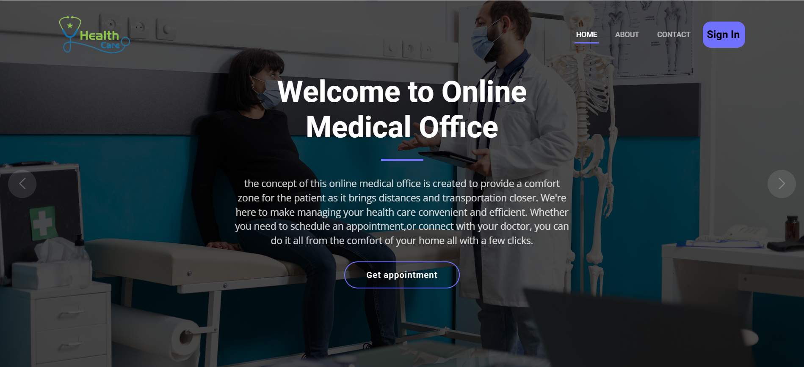

# MedRDV

## Présentation Générale
**MedRDV** 
est une plateforme web conçue pour faciliter la gestion des rendez-vous médicaux en ligne. Elle répond aux besoins des cliniques et des hôpitaux en permettant aux patients de prendre rendez-vous avec des médecins, tout en offrant des outils de gestion aux administrateurs, médecins et secrétaires. 

## Aperçu de l'Interface 

L'interface d'accueil offre une navigation intuitive permettant aux utilisateurs de se connecter et d'accéder aux fonctionnalités adaptées à leur rôle.

---

L'application repose sur quatre rôles distincts :
- Administrateur
- Médecin
- Patient
- Secrétaire

## Fonctionnalités Principales

### Administrateur
- ✅ Ajouter, modifier et supprimer des médecins.
- 🗓️ Planifier ou annuler les sessions des médecins.
- 👥 Consulter les détails des patients.
- 📋 Gérer les rendez-vous des patients.

### Médecins
- 🗂️ Consulter les rendez-vous prévus.
- 📅 Consulter leurs disponibilités programmées.
- 🩺 Voir les détails des patients.
- ✏️ Modifier ou supprimer leurs comptes.

### Patients
- 🖥️ Prendre des rendez-vous en ligne.
- 👤 Créer un compte personnel.
- 🕒 Consulter l'historique des rendez-vous.
- 🔄 Modifier ou supprimer leurs comptes.

### Secrétaires
- ➕ Ajouter des patients manuellement.
- 📌 Programmer des rendez-vous pour les patients manuellement.

### Comptes Prédéfinis pour les Tests
- **Admin** :
  - ✉️ Email : `admin@edoc.com`
  - 🔒 Mot de passe : `123`
- **Docteur** :
  - ✉️ Email : `doctor@edoc.com`
  - 🔒 Mot de passe : `123`
- **Patient** :
  - ✉️ Email : `patient@edoc.com`
  - 🔒 Mot de passe : `123`
- **Secrétaire** :
  - ✉️ Email : `testsec@edoc.com`
  - 🔒 Mot de passe : `123`

## Instructions d'Installation

Pour installer et configurer le projet **MedRDV**, suivez les étapes ci-dessous :

1. 🖥️ Lancez le panneau de configuration XAMPP et démarrez **Apache** et **MySQL**.
2. 📂 Extrayez le fichier ZIP du projet.
3. 📁 Copiez le dossier extrait dans le répertoire "htdocs" de XAMPP.
4. 🌐 Accédez à **phpMyAdmin** via un navigateur : `http://localhost/phpmyadmin`.
5. 🗄️ Créez une base de données nommée `edoc`.
6. 📤 Importez le fichier SQL fourni : `edoc.sql` (présent dans le répertoire racine du projet).
7. 🔗 Accédez au projet dans un navigateur : `http://localhost/edoc-echanneling-main/`.

## Technologies Utilisées
- 🌐 **Serveur** : Apache 2.4.39
- 🛠️ **Langage Backend** : PHP 7.3.5
- 🗃️ **Base de Données** : MySQL 5.7.26
- 🎨 **Frontend** : HTML, CSS

